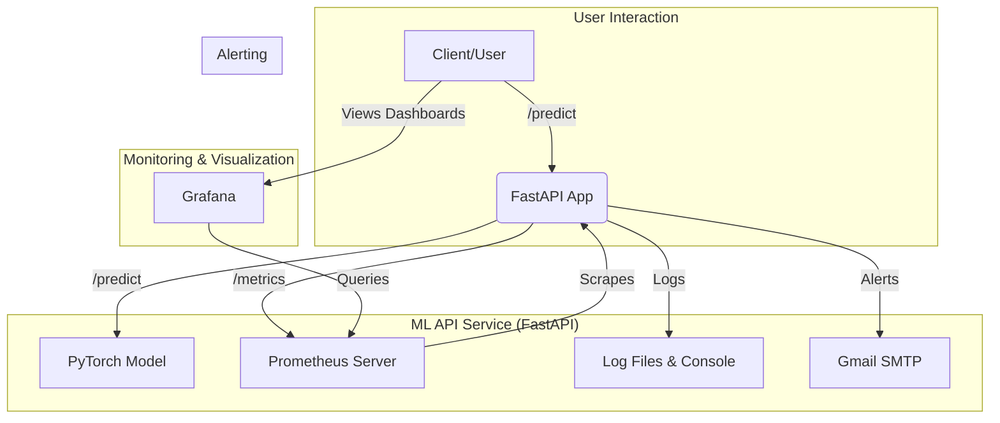

# MLOPS_LAB03

This project provides a robust template for serving a machine learning model (PyTorch, image classification) via a FastAPI backend. It features an extensive, built-in monitoring and alerting system using Prometheus, Grafana, and Gmail.

## Features

- **FastAPI Backend**: High-performance API for model inference.
- **PyTorch Integration**: Serves a ResNet50 model trained on CIFAR-10, ready for GPU or CPU execution.
- **Comprehensive Monitoring (Prometheus)**: Exports detailed metrics for:
  - **API Performance**: Request count, latency, error rates, request/response sizes.
  - **System Resources**: CPU, RAM, Disk I/O, Network I/O.
  - **GPU Health**: Utilization, memory usage, temperature (requires NVIDIA GPU and drivers).
  - **Model Performance**: Inference time, prediction confidence scores, class distribution.
  - **Logging System**: Tracks handler status and log file health.
- **Alerting**: A built-in system that sends critical alerts via Gmail for:
  - High API error rates.
  - Low model confidence.
  - High CPU or memory usage.
- **Dashboard Ready**: Designed to be visualized with Grafana for a real-time overview of the system's health.
- **Structured Logging**: Detailed and multi-destination logging (console, file, syslog) for easy debugging and auditing.

## Architecture Overview



## 1. Prerequisites

- **Python 3.8+**
- **pip** and **virtualenv**
- **NVIDIA GPU** with **CUDA Drivers** installed (for GPU acceleration).
- **Prometheus**: For metrics collection.
- **Grafana**: For data visualization and dashboards.

## 2. Installation and Setup

### Step 1: Clone the Repository

```bash
git clone <your-repository-url>
cd <repository-directory>
```

### Step 2: Set Up External Tools (Prometheus & Grafana)

#### Prometheus

1.  **Download and Install Prometheus** from the [official website](https://prometheus.io/download/).
2.  Create a `prometheus.yml` configuration file in the same directory as the Prometheus executable:

    ```yaml
    # prometheus.yml
    global:
      scrape_interval: 15s # Scrape metrics every 15 seconds.

    scrape_configs:
      - job_name: 'ml-api-monitoring'
        static_configs:
          - targets: ['localhost:8000'] # The address of our FastAPI app.
    ```
3.  You will start Prometheus *after* the API is running (see Step 5).

#### Grafana

1.  **Download and Install Grafana** from the [official website](https://grafana.com/grafana/download).
2.  Start the Grafana server. You can access it at `http://localhost:3000`.
3.  Configure Prometheus as a data source in Grafana:
    - Go to `Configuration > Data Sources > Add data source`.
    - Select `Prometheus`.
    - Set the URL to `http://localhost:9090` (the default Prometheus address).
    - Click `Save & Test`.

### Step 3: Set Up Python Environment

It is crucial to use the specified library versions to ensure compatibility.

1.  **Create and activate a virtual environment:**

    ```bash
    python -m venv venv
    # On Windows
    .\venv\Scripts\activate
    # On macOS/Linux
    source venv/bin/activate
    ```

2.  **Install PyTorch with GPU (CUDA) support:**
    The following command is for a specific CUDA version. Please check the [PyTorch website](https://pytorch.org/get-started/locally/) for the command corresponding to your system's CUDA version.

    ```bash
    pip3 install torch torchvision torchaudio --index-url https://download.pytorch.org/whl/cu128
    ```

3.  **Install the remaining dependencies from `requirements.txt`:**

    ```bash
    pip install -r requirements.txt
    ```

### Step 4: Configure Environment Variables

The application uses a `.env` file to manage secrets for the Gmail alerting system.

1.  Create a file named `.env` in the root of the project.
2.  Add your Gmail App Password to it. **Note**: You need to generate an "App Password" from your Google Account settings, not your regular password.

    ```env
    # .env
    GMAIL_PASS="your_google_app_password"
    ```
3.  You can configure the sender and receiver emails in the `GMAIL_ALERT_CONFIG` dictionary inside `app.py`.

### Step 5: Download Model Checkpoint

The application expects the pre-trained model checkpoint to be in the `checkpoints` directory.

1.  Create a directory named `checkpoints`.
2.  Place your `best_model_logging_demo.pth` file inside it.

## 3. Running the Application

1.  **Start the FastAPI Application:**
    Open a terminal, activate the virtual environment (`venv`), and run:

    ```bash
    uvicorn app:app --host 0.0.0.0 --port 8000
    ```
    The API is now running and accessible at `http://localhost:8000`.

2.  **Start the Prometheus Server:**
    Open another terminal, navigate to your Prometheus directory, and run:
    
    ```bash
    ./prometheus --config.file=prometheus.yml
    ```
    You can access the Prometheus UI at `http://localhost:9090`. Check the `Targets` page to ensure it's successfully scraping the API.

## 4. API Endpoints

Once running, you can interact with the following endpoints:

- **`POST /predict`**: Upload an image for classification.
- **`GET /metrics`**: Prometheus scraping endpoint.
- **`GET /health`**: Basic health check.
- **`GET /api-stats`**: View real-time API performance statistics.
- **`GET /model-stats`**: View real-time model performance statistics.
- **`GET /system-info`**: View system and GPU resource usage.
- **`GET /logging-status`**: Check the status of the logging system.
- **`GET /alerts/status`**: Check the status of the alerting system and current metric values.
- **`POST /alerts/test`**: Send a test email to verify the alert configuration.
